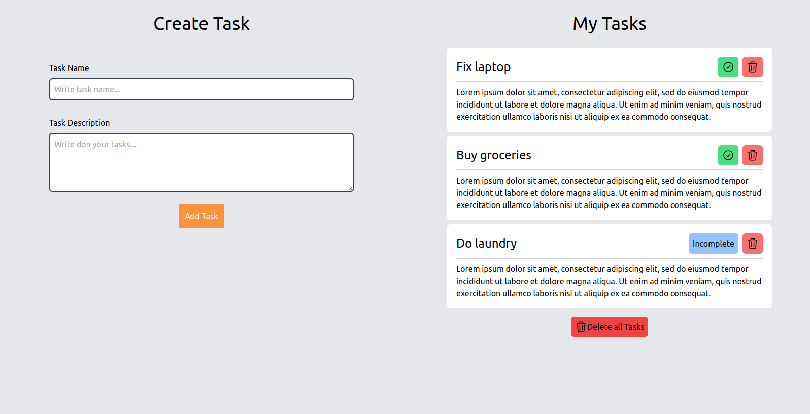

# Task Application

This is an client side application that lets you note down a list of tasks. You can mark your tasks complete and detele a task individually or delete all tasks.

This application connects to a backend Express.js server that stores the tasks into a MySQL database. See [this repository](https://github.com/sonwabileIT/task-app-backend).

### PC View

Populated list

Empty List

### Mobile View

